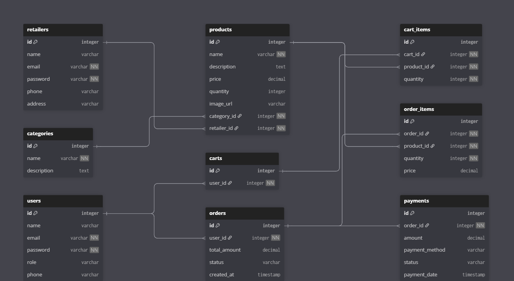

# GritGear 🏋️‍♂️

GritGear is a full-stack e-commerce platform purpose-built for the gym and fitness equipment market. It facilitates a seamless marketplace experience where customers can gear up for their fitness journey, and retailers can manage their inventory with precision.

The project is designed with a focus on **Spring Boot** backend fundamentals, emphasizing a scalable, RESTful architecture and a normalized relational database.

---

## 🏗️ Project Overview

GritGear simulates a real-world e-commerce ecosystem with high-concurrency readiness and secure data handling.

### Key Technical Pillars:
- **Role-Based Access Control (RBAC):** Distinct workflows for Customers, Retailers, and Admins.
- **RESTful API Architecture:** Clean endpoints for decoupled frontend-backend communication.
- **Data Integrity:** A normalized relational database design to handle complex entity relationships.
- **State Management:** Sophisticated handling of shopping carts, order processing, and payment status.

---

## 🛠️ Tech Stack

### Backend
- **Framework:** Spring Boot
- **Persistence:** Spring Data JPA / Hibernate
- **Database:** MySQL / PostgreSQL
- **Communication:** REST APIs

### Frontend (Planned/Optional)
- **Styling/Scripting:** HTML5, CSS3, JavaScript
- **Templating:** Thymeleaf (for Spring MVC integration)

### Tools & DevOps
- **Build Tool:** Maven
- **Version Control:** Git & GitHub
- **API Testing:** Postman
- **Modeling:** dbdiagram.io

---

## ✨ Core Features

### 👤 User / Customer
- **Authentication:** Secure Register and Login.
- **Catalog:** Browse fitness products and categories.
- **Shopping Cart:** Add/remove items with real-time total calculation.
- **Checkout:** Place orders and simulate payment processing.
- **Dashboard:** View personal order history and status.

### 🏪 Retailer
- **Inventory Control:** Add, Update, and Delete product listings.
- **Stock Management:** Real-time inventory tracking.
- **Sales Monitoring:** Track orders specifically related to their products.

### 🛡️ Admin (Future Enhancements)
- User and Retailer account moderation.
- Global Category management.
- Platform-wide monitoring of orders and payment flows.

---
### DataBase Design

## 📊 Database Design

